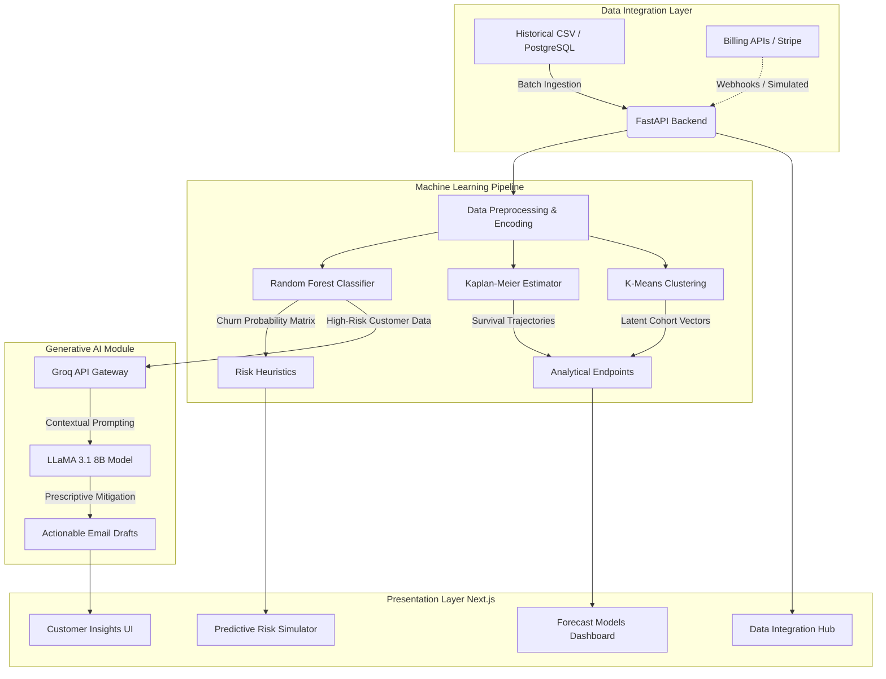

# Cohort Engine: Predictive Churn & Retention Analytics Platform

## Overview
Cohort Engine is a full-stack, AI-driven B2B SaaS platform designed to forecast customer churn, analyze retention probabilities, and autonomously generate actionable retention strategies. By integrating classical machine learning models (Tree-based ensembles, Survival Analysis, Clustering) with state-of-the-art Generative AI (LLaMA 3.1 8B), this platform bridges the gap between raw data analytics and proactive customer success operations.

## System Architecture

The application follows a decoupled architecture, separating the Next.js presentation layer from the FastAPI machine learning inference engine. 



## Core Features & Modules

### 1. Data Integration Hub
* **Unified Workspace:** A simulated environment for connecting production databases, billing gateways, or flat files (CSV).
* **Schema Verification:** Automated data typing, missing value analysis, and tabular preview for connected datasets.

### 2. Predictive Risk Simulator
* **Interactive Scenario Analysis:** Allows users to adjust operational variables (e.g., Tenure, Monthly Charges, Contract Architecture) to observe real-time fluctuations in churn risk.
* **Dynamic Risk Trajectory:** Computes base risk via tree-weight heuristics and projects a 12-month forward-looking risk trajectory using real-time area charting.

### 3. Machine Learning Forecast Models
* **Kaplan-Meier Survival Analysis:** Calculates macro survival trajectories across billing cycles to determine customer lifetime expectancy.
* **Multi-Dimensional Clustering:** Utilizes K-Means vectoring in a standardized feature space to identify distinct customer personas based on billing density and tenure.

### 4. Generative AI Action Engine
* **LLaMA 3.1 Integration:** Communicates with the Groq API to interpret high-risk customer profiles.
* **Automated Retention Strategies:** Generates hyper-personalized, context-aware retention emails outlining specialized discount offers or mitigation strategies tailored to specific churn triggers.

## Technology Stack

**Frontend Layer:**
* Framework: Next.js (React)
* Styling: Tailwind CSS
* Visualization: Recharts (Optimized SVG rendering)

**Backend & ML Layer:**
* Framework: FastAPI (Python)
* Data Processing: Pandas, NumPy
* Machine Learning: Scikit-learn (Random Forest, K-Means, PCA), Lifelines (Kaplan-Meier)

**AI & Integration:**
* LLM: LLaMA 3.1 8B
* Inference Provider: Groq API

## Local Development & Setup

### Prerequisites
* Node.js (v18.0 or higher)
* Python (v3.9 or higher)
* A valid Groq API Key

### Backend Setup
1. Navigate to the backend directory:
```bash
   cd backend
   ```
2. Create and activate a virtual environment:
```bash
   python -m venv venv
   source venv/bin/activate
   ```
3. Install dependencies:
```bash
   pip install -r requirements.txt
   ```
4. Create a `.env` file in the backend directory and add your Groq API key:
```env
   GROQ_API_KEY=your_actual_api_key_here
   ```
5. Initialize the FastAPI server:
```bash
   uvicorn main:app --reload
   ```
   The backend will run on `https://cohort-engine.onrender.com`.

### Frontend Setup
1. Navigate to the frontend directory:
```bash
   cd frontend
   ```
2. Install Node dependencies:
```bash
   npm install
   ```
3. Start the Next.js development server:
```bash
   npm run dev
   ```
   The frontend will run on `http://localhost:3000`.

## Security Notice
Ensure that the `.env` file containing API keys is strictly included in your `.gitignore` to prevent exposure of sensitive credentials to public version control. 

## License
This project is open-source and available under the MIT License.